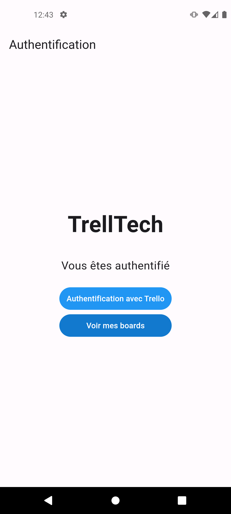
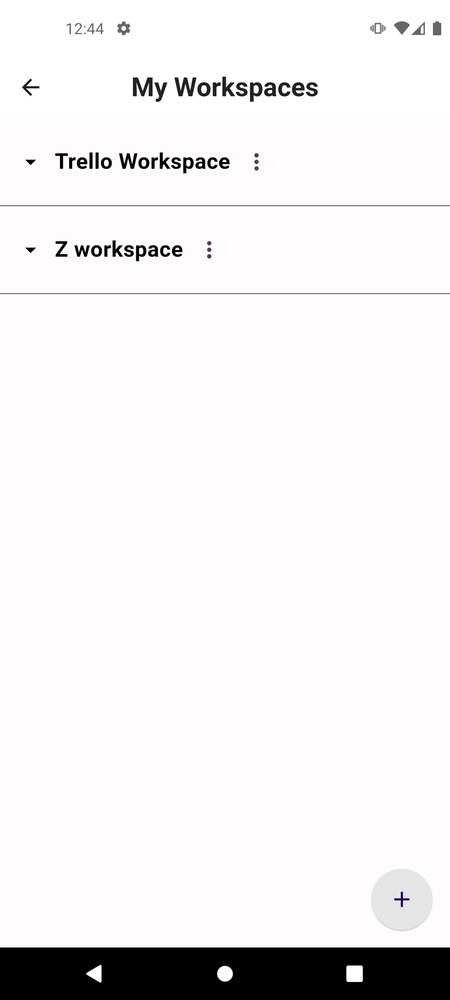
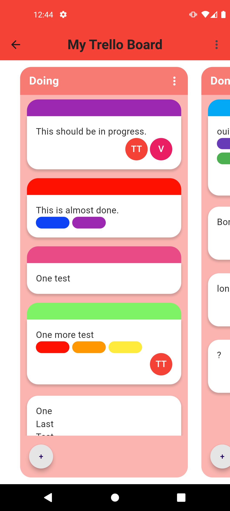
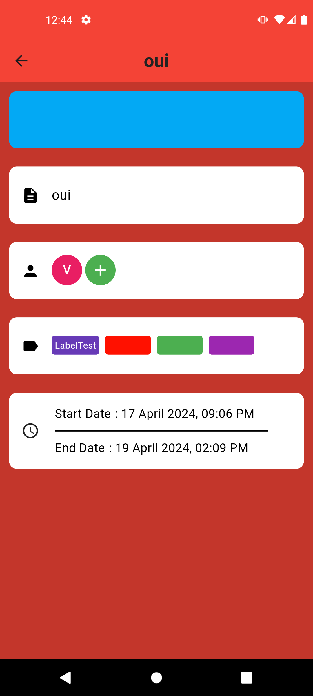
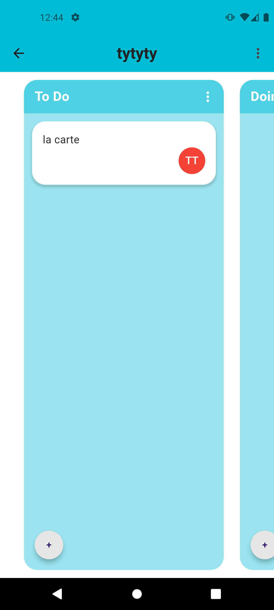
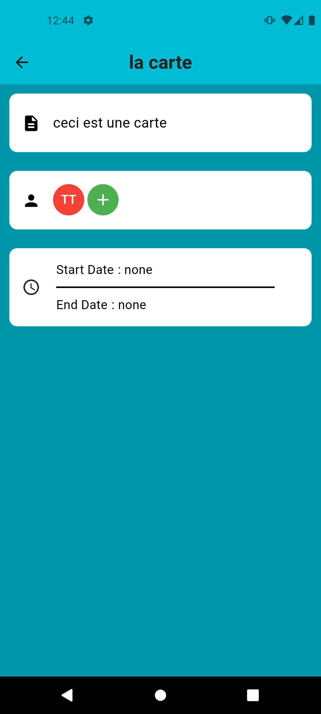

# TrellTech (T-DEV-600)

## Licence

## Introduction 📖
The aim of this project is to create an client side application of the Trello board. The application will be able to create, edit and delete boards, lists and cards. The application will also be able to move cards between lists and boards.

## Screenshots 📸

{width=30%}

{width=30%}

{width=30%}

{width=30%}

{width=30%}

{width=30%}

## Technologies 💯

- Flutter : **[Flutter](https://flutter.dev/)**

## Steps to install 📝

- **Clone repository :**

    ```bash
    git clone
    ```

- **Run Application :**

    ```bash
    flutter run
    ```

## Contributors 💪 
**- Nathan DULAC** <br>
- [Github](https://github.com/Torahime3)
- [Linkedin](https://www.linkedin.com/in/nathan-dulac-2aa654257/)<br>

**- Valerian Alamar** <br>
- [Github](https://github.com/Valamar12)
- [Linkedin](https://www.linkedin.com/in/valerian-a-43171328a/)<br>

**- Scott Fitzgerald** <br>
- [Github](https://github.com/scottfzd)
- [Linkedin](https://www.linkedin.com/in/nigelfitzgerald/)<br>
